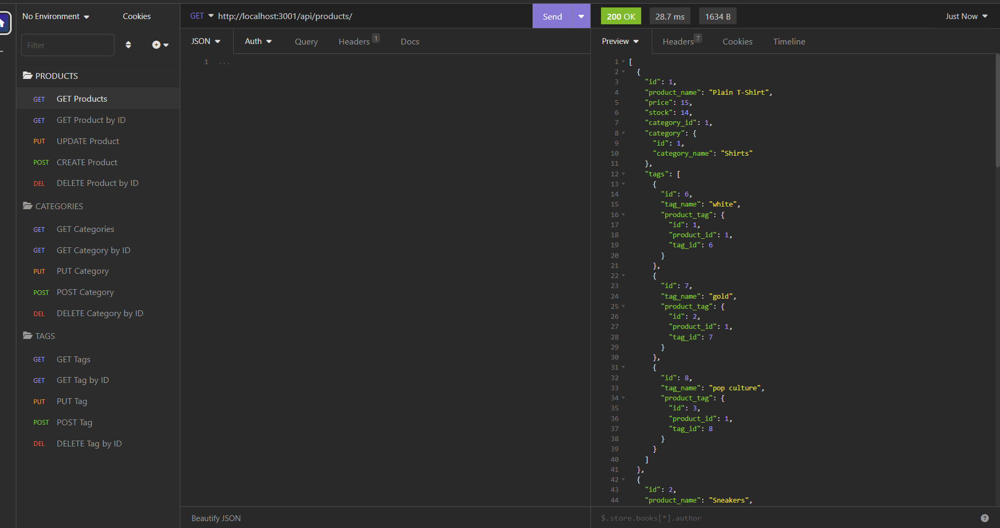
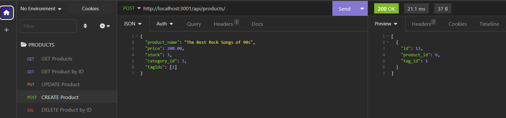

# E-commerce Back End

## Description

The aim of this project was to to build the back end for an e-commerce site. For this purpose, a working Express.js API was configured to use Sequelize to interact with a MySQL database. This application allows a user to create, update, and delete entries from tables of the e-commerce website, such as tags, products, and categories. Working on this project helped me gaininng further understanding of how to create a backend that allows to interact with a database.

## Installation

To create this app, Sequelizer, MySQL2 and the dotenv package were installed.

## Usage

This app may be used to retrieve information from the database such as the information on all products, tags, and categories, or to retriev information on one entry by its ID. In addition, a user can create new entries, update and delete existent ones.  
  
  
[Walkthrough video](https://watch.screencastify.com/v/1fBuiSDCmkuxh4gSAjMu)

## Credits

Luba Mintsys. https://github.com/lmintsys

## License

MIT License

Copyright (c) 2023 lmintsys

Permission is hereby granted, free of charge, to any person obtaining a copy
of this software and associated documentation files (the "Software"), to deal
in the Software without restriction, including without limitation the rights
to use, copy, modify, merge, publish, distribute, sublicense, and/or sell
copies of the Software, and to permit persons to whom the Software is
furnished to do so, subject to the following conditions:

The above copyright notice and this permission notice shall be included in all
copies or substantial portions of the Software.

THE SOFTWARE IS PROVIDED "AS IS", WITHOUT WARRANTY OF ANY KIND, EXPRESS OR
IMPLIED, INCLUDING BUT NOT LIMITED TO THE WARRANTIES OF MERCHANTABILITY,
FITNESS FOR A PARTICULAR PURPOSE AND NONINFRINGEMENT. IN NO EVENT SHALL THE
AUTHORS OR COPYRIGHT HOLDERS BE LIABLE FOR ANY CLAIM, DAMAGES OR OTHER
LIABILITY, WHETHER IN AN ACTION OF CONTRACT, TORT OR OTHERWISE, ARISING FROM,
OUT OF OR IN CONNECTION WITH THE SOFTWARE OR THE USE OR OTHER DEALINGS IN THE
SOFTWARE.
